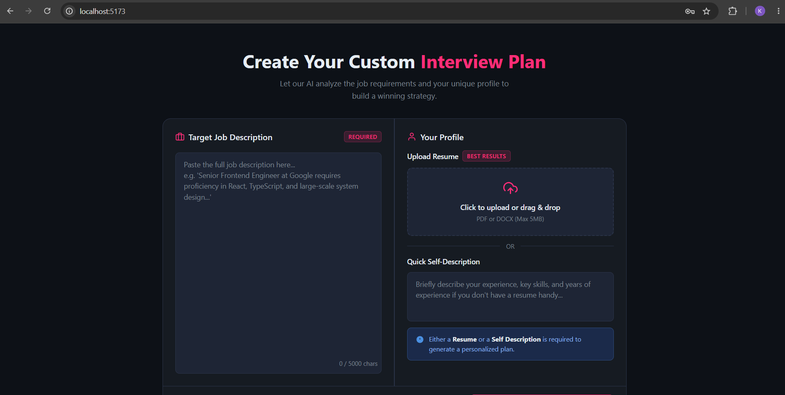
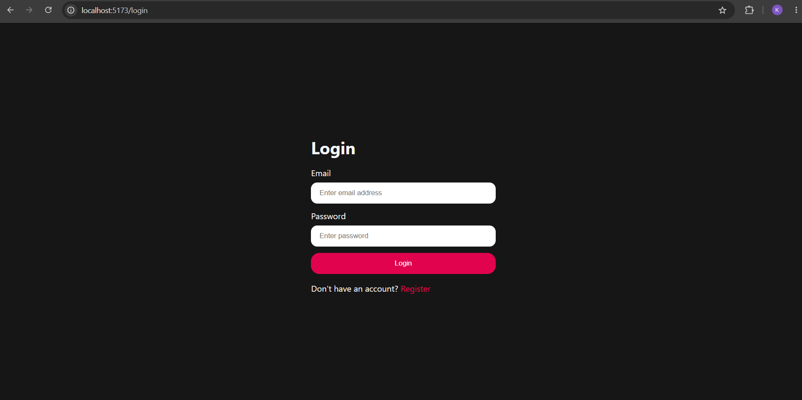
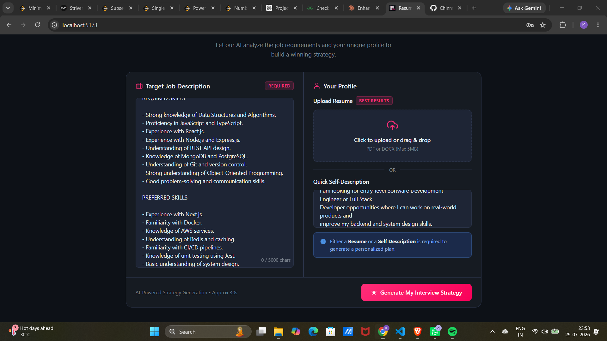
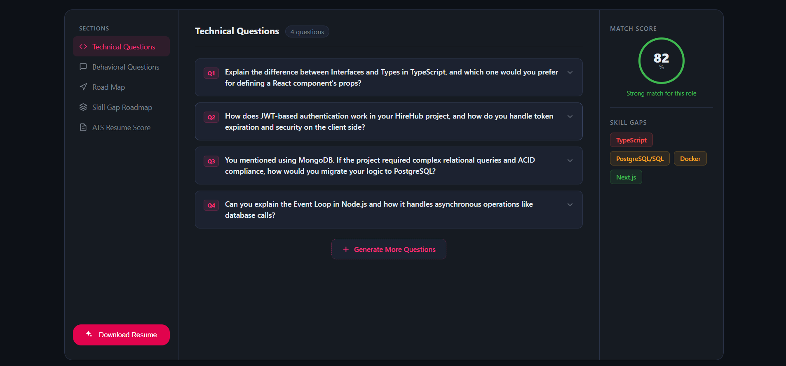
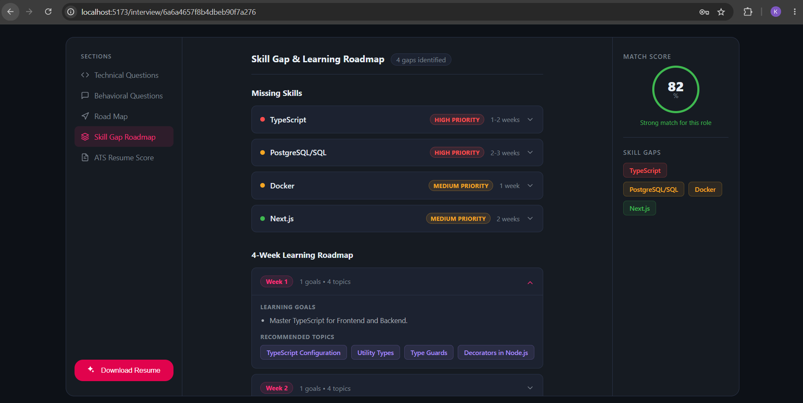
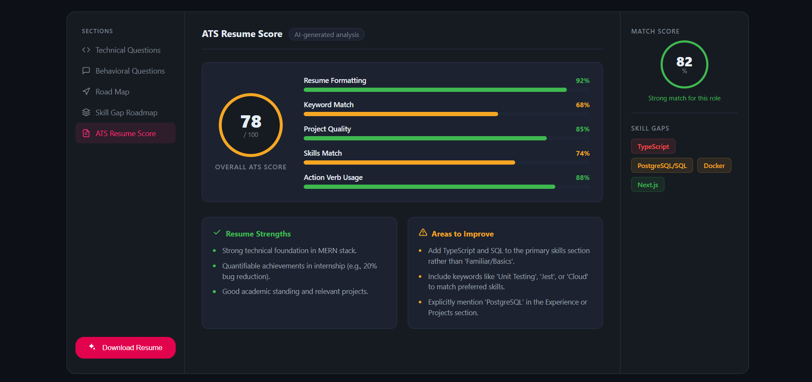

# CareerForge

CareerForge is an AI-powered career preparation platform that helps users improve their resumes, analyze job descriptions, identify skill gaps, and prepare for interviews using Google's Gemini AI.

It provides recruiter-style resume analysis, ATS scoring, AI-generated interview questions, and tailored preparation roadmaps, enabling users to improve their chances of landing their desired roles.

---

## 📸 Screenshots

### Home Page



### Login



### Resume Analysis



### Interview Report



### Skill Gap


### ATS Score


---

# Features

- JWT Authentication using HttpOnly Cookies
- Resume Upload (PDF)
- AI Resume Analysis
- ATS Score & Resume Evaluation
- Job Description Matching
- Skill Gap Analysis
- Technical Interview Questions
- Behavioural Interview Questions
- Personalized Preparation Roadmap
- Download AI Enhanced Resume
- Interview History
- Responsive UI

---

## Tech Stack

### Frontend

- React.js
- Vite
- SCSS
- Axios
- React Router

### Backend

- Node.js
- Express.js
- MongoDB
- Mongoose
- JWT Authentication
- Multer
- PDF Parser

### AI

- Google Gemini API

---

## Folder Structure

```
CareerForge
│
├── Frontend
│
├── Backend
│
└── README.md
```

---

## Environment Variables

### Backend (.env)

```env
PORT=3000

MONGODB_URI=

JWT_SECRET=

GEMINI_API_KEY=

CLIENT_URL=http://localhost:5173

NODE_ENV=development
```

### Frontend (.env)

```env
VITE_API_URL=http://localhost:3000
```

---

## Installation

### Clone Repository

```bash
git clone https://github.com/Kshitiz0504/careerforge.git
```

### Backend

```bash
cd Backend
npm install
npm run dev
```

### Frontend

```bash
cd Frontend
npm install
npm run dev
```

---

# How It Works

1. Register or log in.
2. Upload your resume (PDF).
3. Paste a job description and write a self-description.
4. CareerForge analyzes your resume using Gemini AI.
5. Receive:
   - ATS-style feedback
   - Resume score
   - Skill-gap analysis
   - Technical interview questions
   - Behavioural interview questions
   - Personalized preparation roadmap

---

## Author

**Kshitiz Shukla**
